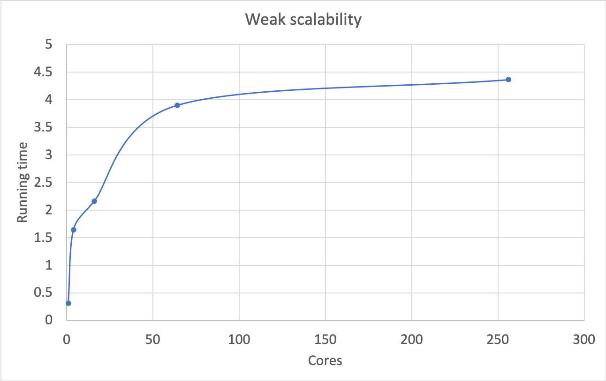
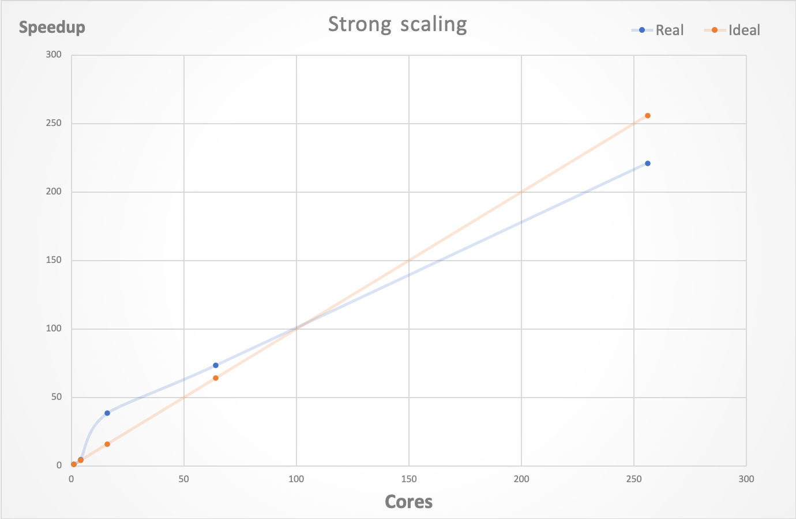

# Usage

```$xslt
make clean
make
mpiexec -np [np] ./jacobi [-nl] [-max_iteration]
mpiexec -np [np] ./ssort [-N]

## or use bash script in slurm_scripts
cd slurm_scripts
bash runsort.sh # submit sort jobs to slurm
bash runweak.sh  # submit weak scaling jobs to slurm
bash runstrong.sh  # submit strong scaling jobs to slurm
```

# Jacobi reports

For scaling experiments, we must specify partition. And the result (running time) is extremely unstable, sometimes 

incredibly fast.

All the result below is run on partition (c01_17, at least is specified as so)

## Weak scaling

Max Iteration = 20000

|  N   | p   | N_l |  Time  | Residual  |
| ---- | --- | --- |  ----- | --------- |
| 100  | 1  | 100  | 0.314247 | 0.00513211 |
| 200  | 4  | 100  | 1.645168 | 14.1556 |
| 400  | 16 | 100  | 2.161828 | 176.08 |
| 800  | 64 | 100  | 3.901601 | 575.316 |
| 1600 | 256 | 100 | 4.366603 | 1375.32 |

Our result shows weak scalability to a certain extent except when p=1. I guess this is because N is small and the single-thread program saves communication costs. (I tried dozens of times and the the result stays similar)



## Strong scaling

Max Iteration = 20000

|  N   | p   | N_l |  Time  | Residual  | Speed up |
| ---- | --- | --- |  ----- | --------- | ---- |
| 1600  | 1  | 1600 | 557.565293 | 1375.32 | 1 |
| 1600  | 4  | 800  | 120.552866 | 1375.32 | 4.62506875 |
| 1600  | 16 | 400  | 14.503465 | 1375.32 | 38.4435921 |
| 1600  | 64 | 200  | 7.600227 | 1375.32 | 73.3616631 |
| 1600 | 256 | 100  | 2.520968  |  1375.32 | 221.171111 |




We can see that the line is basically straight which means it has perfect strong scalability. When cores number is relatively small, it performs even better than ideal model. I speculate this is because in our case N is quite large and it runs extremely slow for single thread, so the speed-up greater than the ideal one. But when cores grows larger, the real speed-up slows down. Because of the cores limit of the prince cluster, I cannot test 1024 cores. However, I guess it will not show linear growth.

# Ssort reports

Cores: 64

|  N   | Time  |
| ---- | ----------- |
| 1e4  | 0.074081    |
| 1e5  | 0.069223    |
| 1e6  | 0.188538    |

The running time of 1e6 is not quite stable. Sometimes it rockets to 2s and more. I think it is related to the random data generation. If the data is not balanced well, then some process will have extensive computation so the total running time is slow.